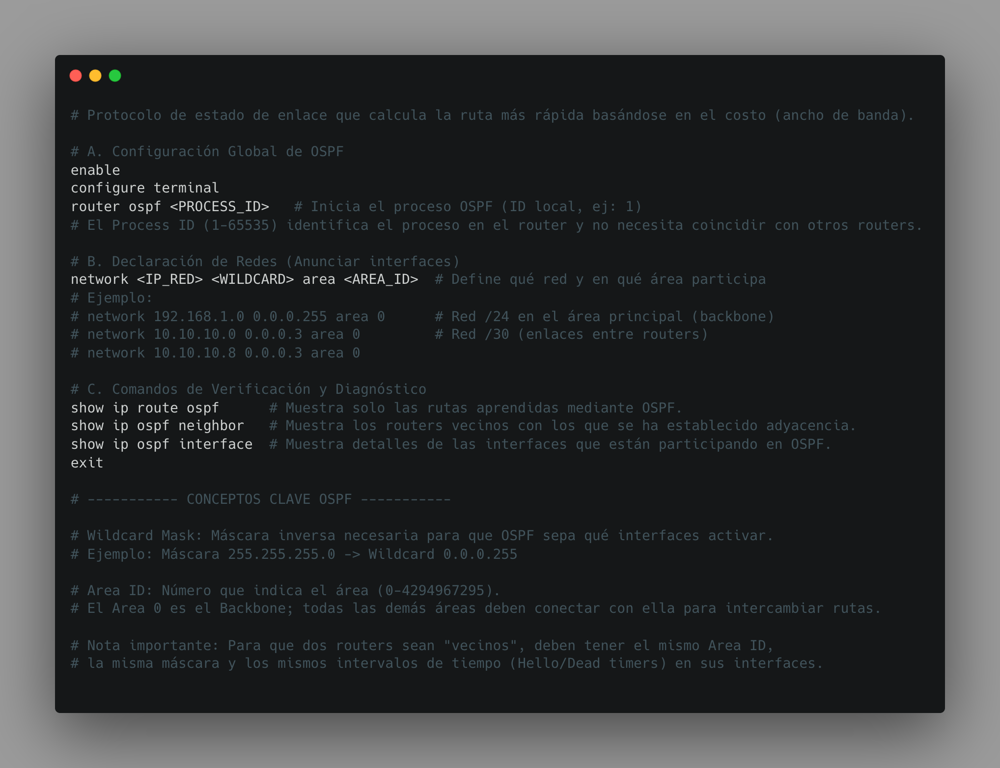
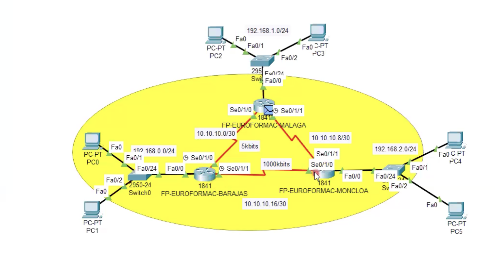

# 🌐 OSPF: Configuración y Funcionamiento

El **Open Shortest Path First (OSPF)** es un protocolo de enrutamiento dinámico de tipo **link-state** diseñado para redes IP modernas.

A diferencia de protocolos más simples, OSPF calcula la mejor ruta basándose en el **coste del enlace (ancho de banda)** y utiliza el algoritmo **SPF (Dijkstra)** para determinar el camino más rápido hacia cada red.

---

## 🧭 ¿Qué es OSPF?

OSPF permite a los routers intercambiar información de red y construir una base de datos del estado de los enlaces (**LSDB**) para calcular rutas óptimas.

### ✔ Características principales

- Protocolo **link-state**
- Convergencia rápida
- Soporta redes grandes y jerárquicas
- Uso del algoritmo SPF
- Balanceo de carga
- Soporte de autenticación
- Métrica basada en **coste (bandwidth)**

---

# 🗺️ Diagramas de Topología OSPF

## 🔹 Topología básica (Single Area)
    ┌───────────┐
    │  Router1  │
    └─────┬─────┘
          │ 10.10.10.0/30
    ┌─────┴─────┐
    │  Router2  │
    └─────┬─────┘
          │ 10.10.10.4/30
    ┌─────┴─────┐
    │  Router3  │
    └───────────┘

LAN R1: 192.168.1.0/24
LAN R2: 192.168.2.0/24
LAN R3: 192.168.3.0/24

👉 Todos los routers pertenecen al **Área 0**.

---

## 🔹 Topología Multi-Área

            AREA 1
    ┌───────────────┐
    │   Router1     │
    └───────┬───────┘
            │
            │
       ┌────┴────┐
       │ Router2 │  ← ABR
       └────┬────┘
            │
            │
    ┌───────┴───────┐
    │   Router3      │
    └───────────────┘
            AREA 0

👉 Router2 actúa como **ABR (Area Border Router)** conectando áreas.

---

# 🌍 OSPF Multi-Área

OSPF permite dividir redes grandes en áreas para mejorar rendimiento y escalabilidad.

## 🎯 Beneficios del diseño por áreas

✔ Reduce tráfico LSAs  
✔ Mejora rendimiento  
✔ Reduce uso CPU y memoria  
✔ Facilita administración  

---

## 🧭 Tipos de routers en OSPF

| Tipo | Función |
|------|--------|
| Internal Router | Todas las interfaces en la misma área |
| Backbone Router | Conectado al área 0 |
| ABR | Conecta múltiples áreas |
| ASBR | Conecta con redes externas |

---

## ⚙️ Ejemplo Multi-Área

### Router ABR

```bash
router ospf 1
 network 10.0.0.0 0.0.0.3 area 0
 network 192.168.10.0 0.0.0.255 area 1            
```
👉 Este router conecta el Área 1 con el backbone.

## 🧪 Laboratorio práctico con 3 routers

### 🎯 Objetivo

✔ Establecer vecindad OSPF
✔ Propagar rutas dinámicas
✔ Verificar tabla de enrutamiento
✔ Comprender el proceso SPF

## Topología del laboratorio

```bash
R1 -------- R2 -------- R3

R1-R2: 10.10.10.0/30  
R2-R3: 10.10.10.4/30  

LAN R1: 192.168.1.0/24  
LAN R2: 192.168.2.0/24  
LAN R3: 192.168.3.0/24  
```
## Configuración

Router 1

```bash
router ospf 1
 network 192.168.1.0 0.0.0.255 area 0
 network 10.10.10.0 0.0.0.3 area 0
```
Router 2

```bash
router ospf 1
 network 192.168.2.0 0.0.0.255 area 0
 network 10.10.10.0 0.0.0.3 area 0
 network 10.10.10.4 0.0.0.3 area 0

```
Router 3

```bash
router ospf 1
 network 192.168.3.0 0.0.0.255 area 0
 network 10.10.10.4 0.0.0.3 area 0
```

## Verificación


```bash
show ip ospf neighbor # Comprobar vecinos
show ip route # Ver tabla de rutas
# Deberiamos ver algo como : O → rutas aprendidas por OSPF
```
## Prueba de conectividad

```bash
# Desde R1
ping 192.168.3.1 # Confirma que el enrutamiento funciona correctamente.
```

## Problemas comunes en el laboratorio

🔹 Wildcard incorrecta
🔹 Interfaces apagadas
🔹 Area ID distinto
🔹 IP mal configurada
🔹 Vecindad no establecida

---



---

## 📽️ Comunidad y Contenido
Puedes seguir mi progreso y contenido adicional en:

* 🎥 **YouTube** → [bitsofalber](https://www.youtube.com/@bitsofalber)
* 📸 **Instagram** → [@bitsofalber](https://www.instagram.com/bitsofalber/)
* 💼 **LinkedIn** → [ahidalgotech](https://linkedin.com/in/ahidalgotech)

---

[⬅️ Volver al menú principal](../README.md)


